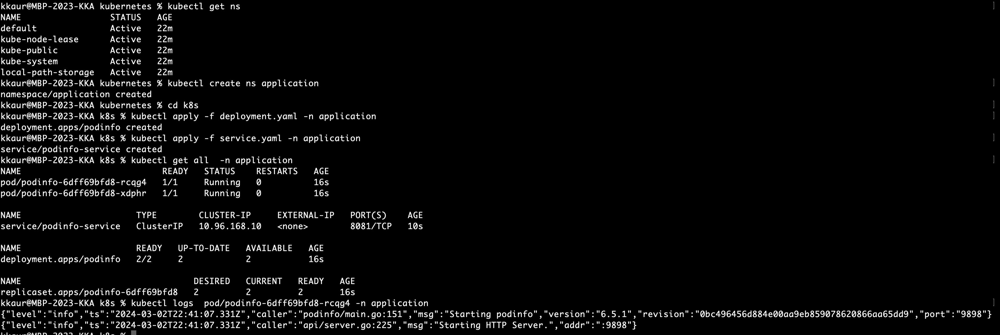
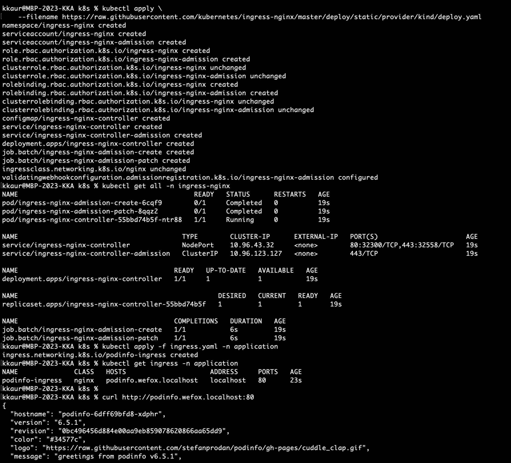
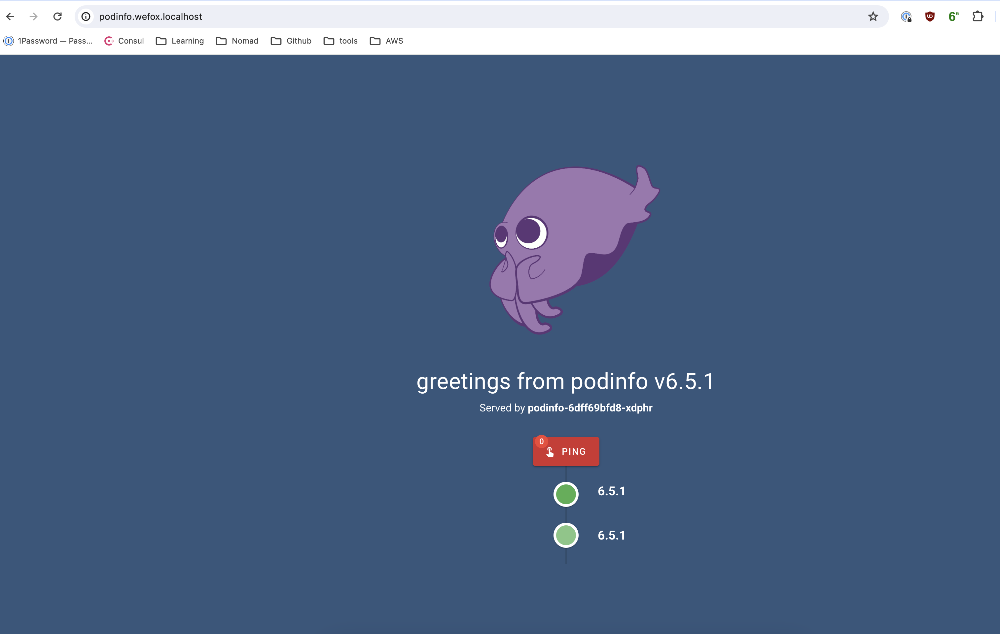
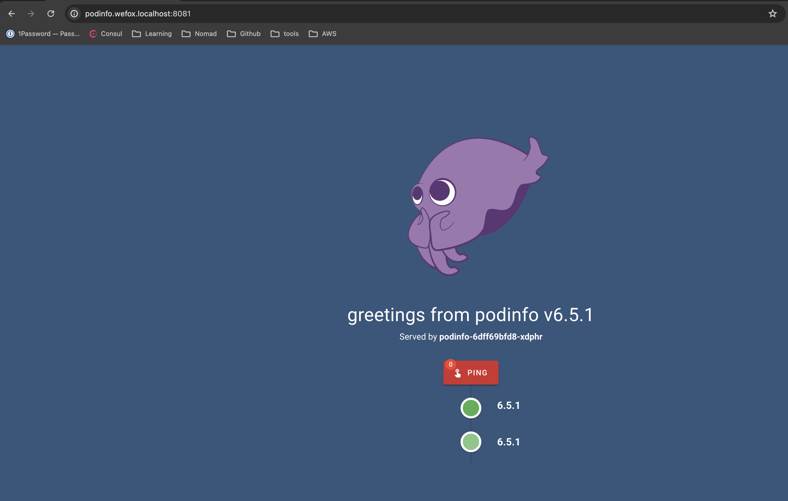
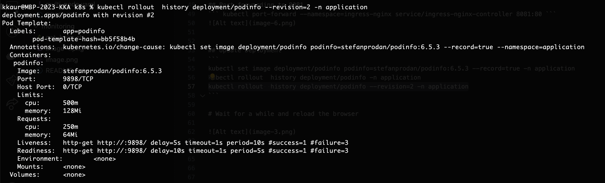
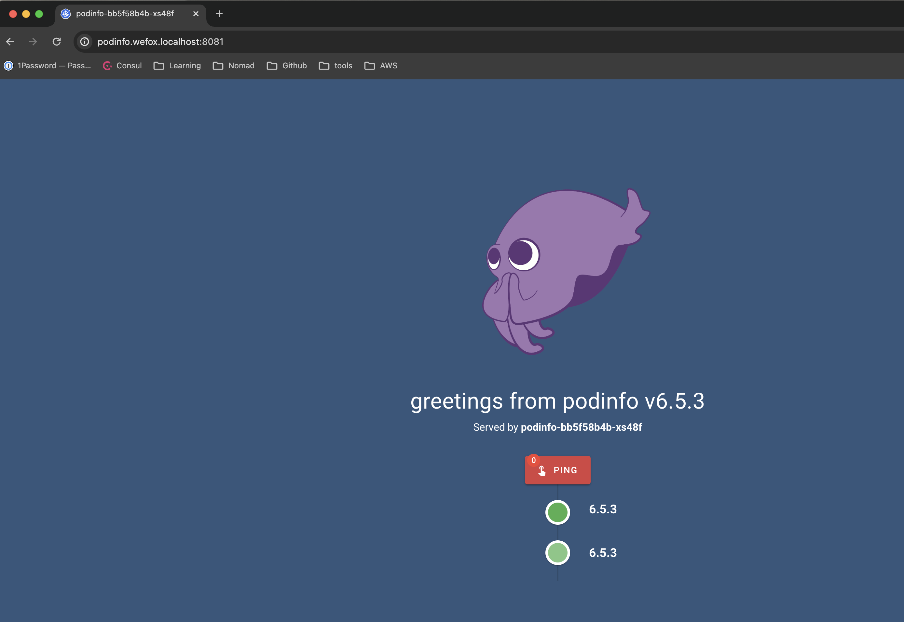

# Deployment of Kubernetes Manifests

To deploy your Kubernetes manifests, follow these steps:

## Create Namespace
Check the current namespaces in your cluster

``` 
kubectl get ns
```

If needed, create a new namespace as below:

```
kubectl create ns application
```

## Deploy Resources:
Navigate to the root folder, Deploy manifests (Deployment & Service) and Verify logs: 

```
cd k8s
kubectl apply -f deployment.yaml -n application
kubectl apply -f service.yaml -n application
kubectl logs pod/pod-name -n application

```
 

## Ingress Setup
#### Deploy Nginx controller in the cluster 
``` 
kubectl apply --filename https://raw.githubusercontent.com/kubernetes/ingress-nginx/master/deploy/static/provider/kind/deploy.yaml
```

For more details, refer to Ingress Nginx Deployment Documentation [here](https://kubernetes.github.io/ingress-nginx/deploy/)

This install will create a separate namespace named ingress-nginx.

Verify the namespace again: ``` kubectl get ns ```

## Apply Ingress: 
``` 
kubectl apply -f ingress.yaml -n application 
```

### Verify 

``` 
curl http:///podinfo.wefox.localhost:80
```



#### Wait for a while and reload the browser
Open http://podinfo.wefox.localhost:80 in a browser

 

## Port Forwarding for 8081:
``` 
kubectl port-forward --namespace=ingress-nginx service/ingress-nginx-controller 8081:80 
```


## Update Deployment:

``` 
kubectl set image deployment/podinfo podinfo=stefanprodan/podinfo:6.5.3 --record=true -n application
kubectl rollout history deployment/podinfo -n application
kubectl rollout history deployment/podinfo --revision=2 -n application 
```


#### Wait for a while and reload 
``` 
http://podinfo.wefox.localhost:8081/ 
```
