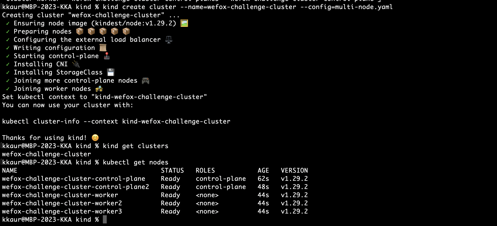

After careful observation as per challenge requirements, I decided to move forward with "KIND"

# Multi-Node Kubernetes Cluster Setup with Kind
This repo contains the code and configuration files for setting up a multi-node (2 master, 3 worker nodes)Kubernetes cluster using Kind (Kubernetes in Docker).

## Pre-requisites
Follow the below steps to setup a multi-node Kubernetes cluster using Kind:

### Step 1: Install Docker Engine on Ubuntu
Docker Engine needs to be installed on Ubuntu. Kindly follow the instructions mentioned [here](https://docs.docker.com/engine/install/ubuntu/) to install Docker Engine.

Version installed: Docker version 24.0.7, build afdd53b

### Step 2: Install Kind
Kind can be installed using the instructions mentioned [here](https://kind.sigs.k8s.io/docs/user/quick-start/#installation).

Version installed: kind version 0.22.0

### Step 3: Install Kubectl
Kubectl is the command-line tool for managing Kubernetes clusters. It can be installed using the following command:
```
snap install kubectl --classic
```
Version installed: Client Version: version.Info{Major:"1", Minor:"27+", GitVersion:"v1.27.9-dispatcher", GitCommit:"8b508a33aafcd3ba51641b6b2ef203adbdd9de1e", GitTreeState:"clean", BuildDate:"2023-12-21T23:19:45Z", GoVersion:"go1.20.12", Compiler:"gc", Platform:"darwin/arm64"}
Kustomize Version: v5.0.1

### Step 4:- Create Single Node Cluster
Create a Single Node Cluster by running the following command:
```
kind create cluster
```

You can check all clusters using the following command:
```
kind get clusters
```

To delete a cluster, run the following command:
```
kind delete cluster --name=<cluster-name>
```

### Step 4:- Create Cluster with present config file 
You can also create a cluster using a configuration file by running the following command:
```
kind create cluster --name=<cluster-name> --config=<file-name>
```


